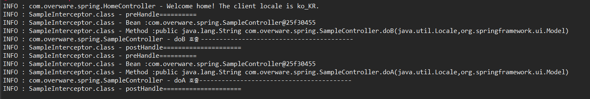

Interceptor
===
* ### Interceptor 정의
  * 특정한 url 호출을 말그대로 가로채는 역할을 한다.  가장 널리쓰이는 역할은 로그인한 사용자만 사용할수 있는 기능을 제어하는데 많이 쓰인다.
  Ingerceptor의 경우는 스프링내의 context내에서 존재하므로 스프링내의 모든 빈객체에 접근할수 있다. filter 의경우는 웹내에서 작동하기 때문에 스프링 내의 context에 접근하기가 어렵다. 그래서 동일한 웹상의 영역에서 필요한 정보를 가져다가 사용한다.
  즉, Interceptor의 경우는 스프링 내의 모든 객체(bean으로 등록한 모든것)에 접근하는 것이 가능해진다.
  ---
* ### AOP의 Advice 와 HandlerInterceptor
  * AOP의 일반적인 경우는 Advice에서 사용한 JoinPoint나 ProceedingJoinPoint 등을 사용해서 호출되는 대 상의 메소드의 파라미터등을 처리하게 된다.
  HandlerInterceptor의 경우는 **ServletRequest,ServletResponse**를 파라미터로 받게 된다. 즉, 컨트롤러에서 사용하는 파라미터를 이용해서 웹과 관련된 처리를 도와주는 역할을 한다는 의미이다. 그래서 **컨트롤러에대한 AOP 설정을 해줄대는 HandlerInterceptor를 사용해서 처리하는 방식이 더 좋다.**

  * <HandlerInterceptor 의 메소드 종류>
    *  **preHandler:** 지정한 컨트롤러가 동작하기 전에 가로채서 사용.3개의 파라미터를 사용(가장 보편적으로 사용), 현재 실행되는 컨트롤러를 파악하거나 추가적인 메소드를 실행하는 등의 작업을 하는데 사용한다.
    *  **postHandler:** 지정한 컨트롤러가 실행된후에 처리 하는 방식 즉 contoller처리 한후DispahcherServlet이 동작하기 전에 동작한다는 의미.
    * **afterCompletion:** DispatcherServlet이 실행된후에 처리.
  ---
* #### servlet-context 설정
1. **servlet-context에 추가**

        <beans:bean id="sampleInterceptor"
          class="com.overware.interceptor.SampleInterceptor"></beans:bean>
            <interceptors>
              <interceptor>
                <mapping path="/doA"/>
                <mapping path="/doB"/>
          <beans:ref bean="sampleInterceptor"/>
              </interceptor>
            </interceptors>
    mapping에는 interceptor로 잡아줄 url매핑 경로를 설정해주면 된다.

2. **SampleInterceptor**

        public class SampleInterceptor extends HandlerInterceptorAdapter {

          private static final Logger logger= LoggerFactory.getLogger("SampleInterceptor.class");

          @Override
          public void postHandle(HttpServletRequest request, HttpServletResponse response,
                            Object hendler, ModelAndView mav) throws Exception{

            logger.info("postHandle=====================");
          }
          @Override
          public boolean preHandle(HttpServletRequest request, HttpServletResponse response,
                            Object hendler) throws Exception{

            logger.info("preHandle==========");

            return true;
          }
        }
      HandlerInterceptorAdapter 를 상속한 클래스를 생성한다. 클래스 이름은 상관없음.

      #### **- preHandle -**
      **HandlerMethod method= (HandlerMethod)handler;** 실행되는 컨트롤러를 보여주는데 사용

      **Method methodObj=method.getMethod();** 실행되는 메소드를 보여주는데 사용

      #### **- postHandle -**
      postHandle은 컨트롤러 메소드의 실행이 끝나고 view 에 출력하기 때문에 view에 출력할것이 따로 필요한것이 있다면 추가작업이 가능하다.

        @Override
        public void postHandle(HttpServletRequest request, HttpServletResponse response,
                      Object hendler, ModelAndView mav) throws Exception{

          logger.info("postHandle=====================");

          Object result=mav.getModel().get("result");

          if(result !=null) {
            request.getSession().setAttribute("result", result); // result값을 set하고 session에 담아서 서버에 요청처리 하고 doA를 호출
            response.sendRedirect("/doA");
          }
        }

    예를 들어서 이렇게 처리를 안한다면 controller단에서 model객체를 생성하고 model에 결과를 담고 controller에서 session에 담아서 처리를 해야 하는데 postHandle을 사용하면 메소드를 실행하고 아직 view에 결과를 보내기 전에 intercepter에서 스틸해서 model에 있는 정보를 session에 담아서 view로 보낼수가 있다.

      ---
* #### preHandler와 postHandler 적용한 Log
  
  로그 정보를 보게 되면 preHandler 가 먼저 실행되고 postHandler 가 후에 실행되는 것을 볼수 있다.
