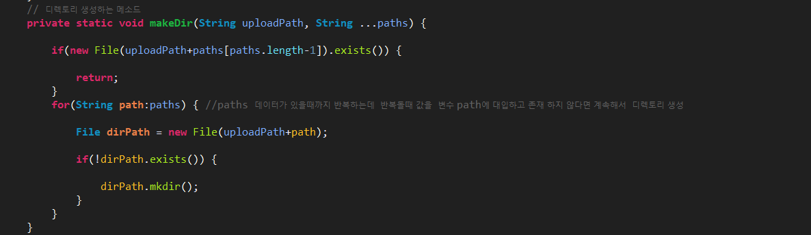
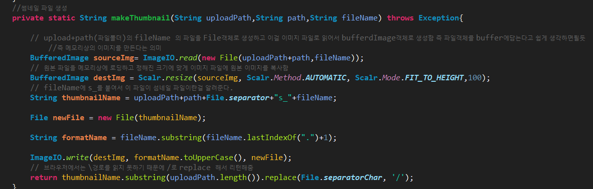
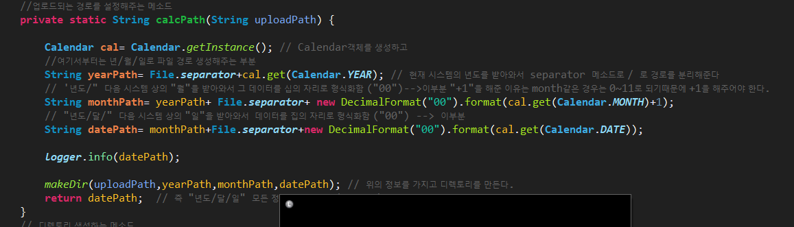
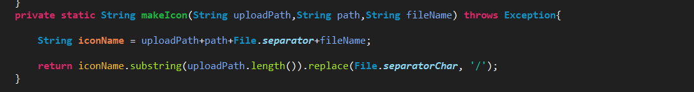
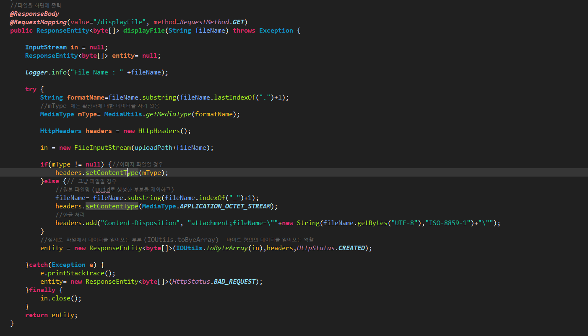
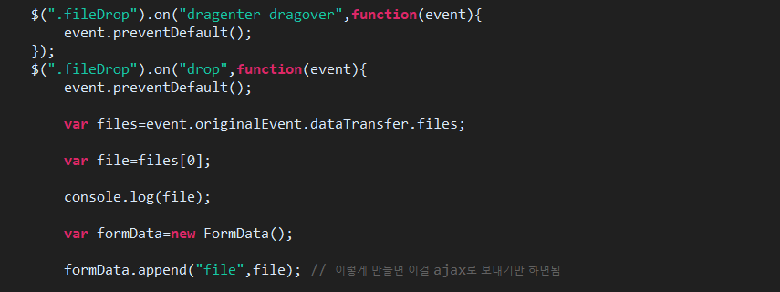
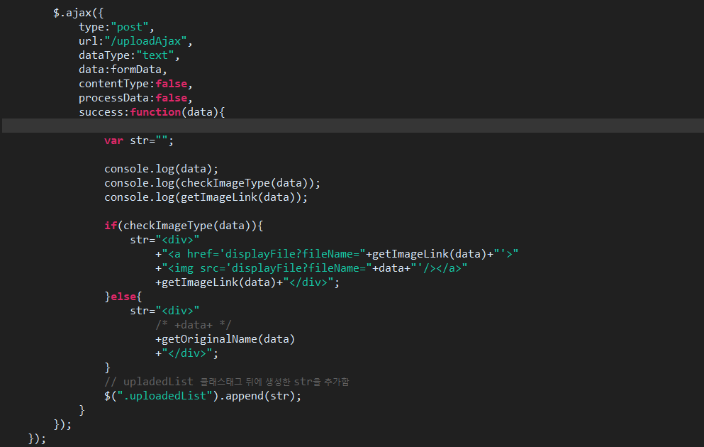
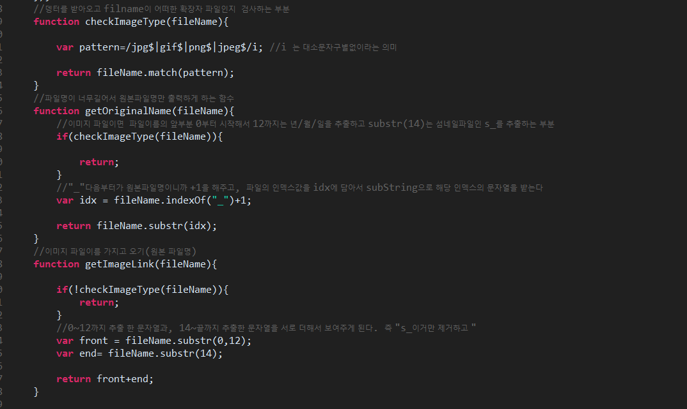

파일 업로드(Ajax)
===
* ### 사용했던   함수,JQery와 AJax처리
  **1. event.preventDefault():** 기본 동작을 막는 기능.
    * $(".fileDrop").on("drop",function(event){
		**event.preventDefault();**
    파일을 drop했을때 기본동작은 새로운창에서 파일이 열기게 되는데 이러한 기본 이벤트 처리를 막는 것이다.

  **2. originalEvent.dataTransfer.files():** dataTransfer는 데이터를 가지고 오는데 그중에 파일 데이터를 찾는데 사용하고 ginalEvent()는 순수한 DOM 이벤트를 가지고 오는데 사용된다.즉 , 정리하자면 drop 데이터에서 파일 데이터를 찾아서그것을 originalEvent를 사용해서 dom객체로 만들어준다  console.log를 찍어보면 DOM객체의 정보를 볼수가 있다.
  **3. FormData:** < form >태그로 만든 데이터의 전송방식과 동일하게 파일 데이터를 전송할수 있다. 필요한 데이터이름과 값을 추가하면 됨.
  즉, formData객체로 controller에게 file정보를 보내는 것이다.
  FormData 객체의 파일 데이터를 보내기 위해서는 **processData**와 **contentType** 션을 반드시 false로 주어야 한다.
  예를들어서 Json형태로 보낼때 contentType을 application/json 형식으로 보냈는데 이런식으로 안하고 형식을 지정안해주면 true값을  application/x-www-form-urlencode형식이 된다.
  processData의 경우는 데이터를 일반적인 string으로 변환할지 결정하는 것인데. 기본값은  application/x-www-form-urlencoded 형식이 된다.  다른 형식으로 보내기위해서 자동으로 변환되지 않게 **false**로 준것 즉, formData형식으로 해야하기 때문에 자동으로 형식이 변하지 않도록 함.

    ---
* ### 파일이 저장될때 고려해야할 문제들
  * 파일을 업로드할때 파일이름의 중복문제 (UUID를 이용해 고유파일명 생성)
  * 파일의 저장경로에 대한 문제(년/월/일 로 파일생성)
  * 브라우저에서 보여질 파일의 크기 문데(Sumbnail방식으로 해결)
  ---
* ### 파일의 업로드 순서
  1. UUID 를 이용해서 고유한 파일명 생성
  2. UUID+원본파일명으로 업로드한 파일에 대한 파일명 생성
  3. 파일이 저장될 년/월/일 정보를 생성
  4. 업로드 될 경로를  UploadPath(현재는 D:/imgage/upload) + 년/월/일 로 된 폴더를 생성
  5. 최종적으로 업로드되는 파일명은  uploadPath+년/월/일/ +UUID+원본파일명 으로 파일이 저장되게 된다.
  6. 여기서 이미지 파일이면 썸네일 파일로 (s_) , 아닌것은 그냥 생성된 파일명을 사용해서 업로드 되게 한다.
  ---
* ### 파일 업로드에 대한 정보를 담고 있는 Util클래스
  1. 디렉토리 생성
  
  2. 썸네일 파일생성
  
  3. 업로드 경로설정
  
  4. 일반파일 경우 파일명 설정
  
  ---
* ### Controller
  1. 브라우저에  이미지 파일 출력
  
  ---
* ### view(JQuery)
  1. 데이터를 컨트롤러에 전달할때 FormData형식을 사용해서 보냄
  
  2. 화면에 출력하는 부분으로 이미지경우와 일반파일일 경우 따로 분리해서 처리
  
  3. 확장자검색하는 부분과 파일명이 길어서 일반파일일 경우 원본 파일명, 이미지 파일명인 경우 썸네일 구분자인 s_를 제외시키기위해서 subString을 사용해서 0~12까지 추출한(폴더명) 문자열과 원본파일명(14번째 문자열부터..) 을 합쳐서 보여주게 함 
  
