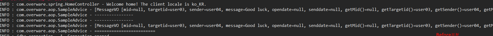
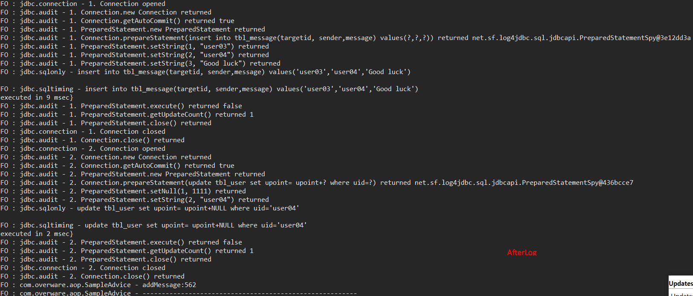

AOP관련 연습1(AOP적용 하기위한 준비)
===
### 1. 관련 라이브러리 다운로드(pom.xml)
        <!-- aop관련 라이브러리 -->
		<dependency>
			<groupId>org.springframework</groupId>
			<artifactId>spring-aop</artifactId>
			<version>${org.springframework-version}</version>
		</dependency>
		<!-- 트랜잭션 처리 라이브러리 -->
		<dependency>
			<groupId>org.springframework</groupId>
			<artifactId>spring-tx</artifactId>
			<version>${org.springframework-version}</version>
		</dependency>
		<!-- AspectJ -->
		<dependency>
			<groupId>org.aspectj</groupId>
			<artifactId>aspectjrt</artifactId>
			<version>${org.aspectj-version}</version>
		</dependency>
		<dependency>
			<groupId>org.aspectj</groupId>
			<artifactId>aspectjtools</artifactId>
			<version>${org.aspectj-version}</version>
		</dependency>

### 2. root-context
      <!-- Proxy객체 생성을 위해서 잡아줌 -->
	<aop:aspectj-autoproxy></aop:aspectj-autoproxy>
	 <!--aop 빈 객체 자동생성  -->
	<context:component-scan base-package="com.overware.aop"></context:component-scan>

### 3.예제용 데이터 베이스 생성
      create table tbl_user(
          uid varchar(50),
          upw varchar(50),
          uname varchar(100),
          upoint int(11),
          primary key (uid)
      );

      create table tbl_message(
          mno int not null auto_increment,
          targetid varchar(50) not null,
          sender varchar(50) not null,
          message text not null,
          opendate timestamp,
          senddate timestamp not null default now(),
          primary key(mno)
      );

      alter table tbl_message add constraint fk_usertarget foreign key(targetid) references tbl_user(uid);

      insert into tbl_user(uid,upw,uname) values('user00','user00','재훈');
      insert into tbl_user(uid,upw,uname) values('user01','user01','재훈1');
      insert into tbl_user(uid,upw,uname) values('user02','user02','재훈2');
      insert into tbl_user(uid,upw,uname) values('user03','user03','재훈3');
      insert into tbl_user(uid,upw,uname) values('user04','user04','재훈4');

### 4. UserVO, MessageVO
	public class UserVO {

		private String uid; //사용자아이디
		private String upw; // 패스워드
		private String uname; //이름
		private int upoint; //포인트
	}

	public class MessageVO {

		private Integer mid; // 메세지 구분 아이디
		private String targetid; //포인트를 보낼 아이디
		private String sender; //사용자 아이디
		private String message; //메세지
		private Date opendate; // 메세지 본 날짜
		private Date senddate;//메세지 보낸 날짜
### DAO
	public interface MessageDAO {
		//메세지 작성
		public void create(MessageVO vo) throws Exception;
		//메세지 가지고오기(조건에 맞는)
		public MessageVO readMessage(Integer mid) throws Exception;
		//업데이트
		public void updateState(Integer mid) throws Exception;
	}

	public interface PointDAO {
		//포인트 증가,감소(Impl에서는 map으로 set:두개의 파라미터를 사용하니까 )
		public void updatePoint(String uid, int point) throws Exception;
	}
### Mapper(Message,Point)
	<mapper namespace="com.overware.mapper.MessageMapper">

	<insert id="create">
		insert into tbl_message(targetid, sender,message) values(#{targetid},#{sender},#{message})
	</insert>
	<select id="read" resultType="MessageVO">
		select * from tbl_message where mid=#{mid}
	</select>
	<update id="updateState">
		update tbl_message set opendate=now() where mid=#{mid}
	</update>
</mapper>

	<mapper namespace="com.overware.mapper.PointMapper">
		<update id="updatePoint">
			update tbl_user set upoint= upoint+#{upoint} where uid=#{uid}
		</update>
</mapper>

### Service,ServiceImpl
	@Service
	public class MessageServiceImpl implements MessageService {

		@Inject
		private MessageDAO messageDAO;

		@Inject
		private PointDAO pointDAO;
		@Override
		public void addMessage(MessageVO vo) throws Exception {
			//새로운 매세지를 추가하면서 메세지를 보낸사람에게 10포인트를 추가함
			messageDAO.create(vo); //
			pointDAO.updatePoint(vo.getSender(), 10);

		}

		@Override
		public MessageVO readMessage(String uid, Integer mno) throws Exception {
			//메세지를 조회하고
			messageDAO.updateState(mno);
			//메세지를 조회한 사람은 포인트가 5포인트 올라가고
			pointDAO.updatePoint(uid, 5);
			//다작업한후에는 메세지를 조회해서 반환
			return messageDAO.readMessage(mno);
		}
	}
### Controller
	@RestController
	@RequestMapping("/message")
	public class MessageController {

		@Inject
		MessageService messageService;

		@RequestMapping(value="/",method=RequestMethod.POST)
			public ResponseEntity<String> addMessage(@RequestBody MessageVO vo) {

				ResponseEntity<String> entity = null;

				try {
					messageService.addMessage(vo);
					entity= new ResponseEntity<>("SUCCESS",HttpStatus.OK);

					}catch(Exception e) {
						e.printStackTrace();
						entity=new ResponseEntity<>(e.getMessage(),HttpStatus.BAD_REQUEST);
					}
					return entity;
				}
	}
@REST컨트롤러를 사용해서 Ajax로 데이터를 보내고 그때 로그정보들이 어떻게 찍히는지에 대해서 연습.

AOP관련 연습2(Log)
===
* ## AOP 관련 용어들

>1. **Aspect**:로깅이나  보안, 트랜잭션과 같은 기능에 대한용어로서  @Asperct를 사용해서  AOP기능을 하는 클래스에 선언해서 이게 AOP라고 말해주는 기능.
>2. **Adive**: 실제로 적용시키고 싶은 코드, 즉  우리는 Ascpect를 구현하는 것이 아니라 Advice를 구현하고 그에 맞게 @Aspect를 적용하는 것이다.
>3. **JoinPoints**: 작성된 Advice가 실행되는 위치를 말한다.  쓰이는 기능들은 아래와 같다.
>>* **Object[] getArgs()**: 전달되는 모든 파라미터들을 Object의 배열로 가지고옴
>>* **Signature getSignature()**: 실행하는 대상 객체의 메소드에 대한 정보를 알아냄
>>* **Stirng getKind()**: 해당 Advice의 타입을 알아낸다
>4. **Pointcuts**:여러메소드 중 실제 Advice가 적용될 대상을 선택하는 정보
>5. **target**:대상 메소드를 가지는 객체
>6. **proxy**:Advice가 적용되었을때 만들어지는 객체
>7. **introduction**:target에는 없는 새로운 메소드나 변수를 추가하는 기능
>8. **Weaving**:Advice와 target이 결합되어서 프록시 객체를 만드는 과정
---
* ### 쓰이는 어노테이션
>1.**Before:** target 의 메소드를 호출하기 전에 적용
>2.**After:** target의 메소드 호출후 예외상관없이 적용(After returning, After thowing 두가지 포함)
>3.**Around:** target이 메소드 호출 이전과 이후 모두 적용(제일 광범위하게 사용됨) Around사용시 리턴 타입은 Object로 선언해야 한다 . 이유는 Around 는 메소드를 직접호출하고, 결과를 반환 해야만 정상적인 처리가  이루어지기 때문이다
---

* ### Advice 클래스

		@Component
		@Aspect
		public class SampleAdvice {

			private static final Logger logger = LoggerFactory.getLogger(SampleAdvice.class);

			@Before("execution(* com.overware.service.MessageService*.*(..))")
			public void startLog(JoinPoint jp) {

				logger.info("----------------");
				logger.info("----------------");
				logger.info(Arrays.toString(jp.getArgs())); // 전달되는 파라미터들을 object배열로 가지고 온다
				logger.info("=========================");
			}
			@Around("execution(* com.overware.service.MessageService*.*(..))")
			public Object timeLog(ProceedingJoinPoint pjp) throws Throwable{
				long startTime=System.currentTimeMillis();
				logger.info(Arrays.toString(pjp.getArgs()));

				Object result= pjp.proceed();

				long endTime= System.currentTimeMillis();
				logger.info(pjp.getSignature().getName()+":"+(endTime-startTime));
				logger.info("--------------------------------------------------------");

				return result;
			}
		}
**Before의 경우**는 파라미터를 보면  JoinPoint를 주어서 자기가 원하는 데이터를 가지고 오게끔했는데 보면 jp.getArgs() 를 사용해서 전달되는 파라미터들을 vo객체로 가져와서 보여지는걸  아래 결과물에서 볼수 있다
**Around의 경우**는 끝부분 로그를 보면 getSignature()를 사용해서 해당 메소드를 호출했고 pjp.getArgs()를 이용해서 해당객체의 메소드까지 실행해서 리턴하는 것까지 보여지고있다. (**ProceedingJoinPoint** 는 JoinPoint의 상위 클래스로 JoinPoint의 내용을 다 가지고 있으면서 target의 메소드까지 실행하는 기능을 가지고있다.)

---
* ### 결과물과  내용
1.Berfore관련 로그

2.Around 관련 로그

---
* ###  오류들과 주의사항

1. AOP 잡아주지 못할때 에러

**Pointcut is malformed: Pointcut is not well-formed: expecting 'name pattern' at character position 50 execution(*com.overware.service.Message Service*.*(..))**

문제는 pointcut 잡아줄때 *com 에서 * 다음 한칸을 띄어야 한다는점이었다

2. AOP log info 정보가 안나왔을때 log4j.xml 파일의

		<root>
		<priority value="info" />
		<appender-ref ref="console" />
		</root>
priority value="" 값을  **"info"** 로 주면 된다.
