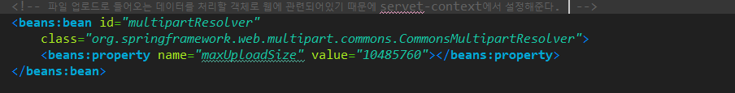
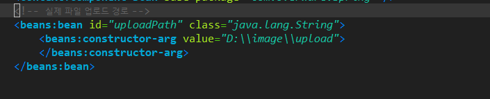
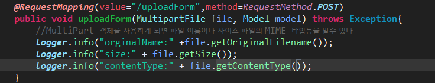
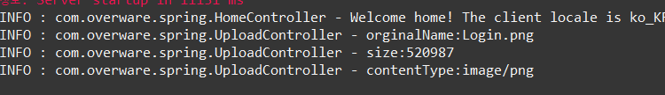
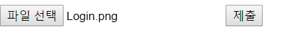
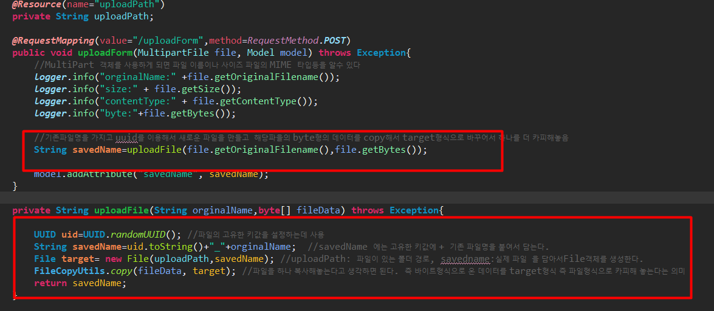
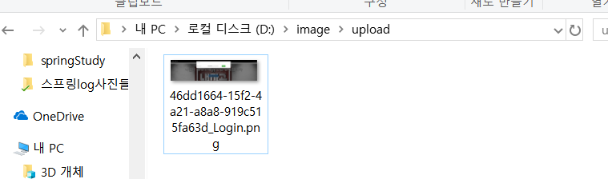

스프링 파일 업로드(form)
===
* ### 파일 업로드에서 활용할 기능
1. 파일 업로드 처리는 직관적으로 사용자가 사용할수 있도록 **Ajax**처리를 한다.
2. 이미지 파일의 경우는 원래의 이미지보다 작은 **썸네일 파일**을 생성해서 처리.
3. 이미지 파일과 일반 파일들 모두 서버에 저장하고 다운로드 할수 있도록 처리.

* ### 서버에서는 업로드와 관련한 작업
1. 사용자가 업로드하는 시간에 따라서 자동적으로 폴더를 생성.
2. 업로드되는 파일의 고유한 이름 생성(uuid를 이용해서 )
3. 이미지 파일을 업로드할때 썸네일 파일 생성
4. 이미지 파일의 경우 서버에서 저장된 파일을 먼저 읽고 적당한 타입으로 서비스
5. 일반파일의 경우는 다운로드 타입으로 파일데이터를 서비스함.
---
* ### 파일 업로드 설정
1. 관련 라이브러리 다운로드
    * **imgscalr :** 큰이미지를 고정된 크기로 변환할때 사용하는 라이브러리
    * **comms-fileupload:** 파일 업로드할대 필요한 라이브러리
2. 파일 업로드 관련한 bean 설정
    * **mltipart/form-data:** 데이터를 여러조각으로 나누어서 전송하는 방식으로 대용량의 데이터를 전송할때 유용하게 쓰인다. 그리고 multipart 방식으로 데이터가 전송되지 않으면 데이터는 전송되지 않는다.
        
    * **uploadPath:** 실제로 파일이 저장될 경로
    

    - 파일 업로드로 들어오는 데이터를 처리할 객체로 웹에대한 설정이이기 때문에 servlet-context에서 설정을 잡아준다.
    - maxsize는 10MB정도로 잡아주었다.
---
* ### 파일 업로드에 대한 흐름 이해하기
  * 일반적으로 파일의 업로드는 < input type="file" > 을 만들어서 업로드 하는 형태이다. 그럼면 알아서 파일 업로드할 새창이 생성된다.
  * **MultiPartFile :** 전송된 파일의 이름(orginalName)파일크기(size), 확장자(MIME:확장자)등의 파일 정보를 알수 있다.
   
  
  * 만약에 한글이 깨져서 나온다면 web.xml에 filter를 추가해주면 해결된다.
  * filesave
  
  **String savedName=
  uploadFile(file.getOriginalFilename(),file.getBytes());**
  uploadFile()내부에서 실페 파일 처리는 스프링에서 제공하는 fileCopyUtils를 이용한다.
  **UUID uid=UUID.randomUUID():** 파일의 고유한 키값을 생성하기 위해서 사용한다.
  **String savedName=uid.toString()+"_"+orginalName:** UUID로 생성한 키값에 _를 붙이고 원래 파일명을 더해서  고유한 파일 명을 만든다.
  **File target= new File(uploadPath,savedName):** 파일이 있는 경로와 방금생성한 파일을 파일겍체로 생성한다.
  **FileCopyUtils.copy(fileData, target):** 마지막으로  기존파일 데이터를 파일 객체로 만들어놓은 target 형식의 파일로  outputStream으로 전송한다.
  
