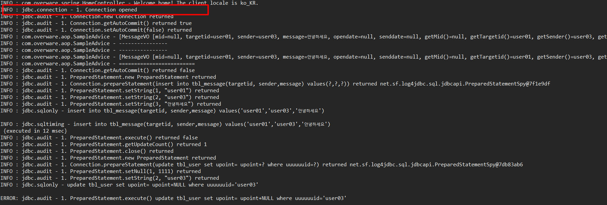

트랜잭션 연습
===
### 1.트랜잭션의 정의
> * 기본개념은 하나의 작업 무조건 commit되거나 rollback 되어야 한다는 점이다.
예를들어서  게시판을 생각해보자. 게시판에서 댓글을 추가했을때 댓글의 수를 업데이트 해야  온전한  흐름일 것이다.  그러면 여기서  만약에 댓글 업데이트에 관한 처리가 오류가 났을시에 댓글도 추가되지 말아야 하지만 트랜잭션 설정을 하지 않았을 경우에 댓글은 등록이 되고 댓글수는 증가하지 않게 되면서 오류가 발생한다.
이러한 문제를 해결하기 위해서  트랜잭션은  두가지의 조건이 모두 만족했을때 commit하고 하나라도 오류가 있으면  rollback을 해서 원래 상태로 되돌리게 된다.
다음 예시를 통해서  해보겠다.
---
### 2. 트랜잭션 설정

    <bean id="transactionManager"
      class="org.springframework.jdbc.datasource.DataSourceTransactionManager">
      <property name="dataSource" ref="dataSource"></property>
    </bean>
    <tx:annotation-driven/>

* 데이터 베이스에 대한 자원사용 이기 때문에  transactionManager에 dataSource를 주입받도록 하고 < tx:annotation-driven > 설정을 잡아주어서 @Transactinal 을 사용할수 있게 함.

### 3. 실행 결과
* MessageService

> 이부분에 대한 로직은 사용자가 메세지를 보냈을때에 포인트가 10포인트가 증가하게 되는 로직이다.

* 트랜잭션 설정을 잡아주지 않았을때

> 즉 여기서 보면 create에 대한 처리는 되고 updatePoint에 대한것은 실행이 안되어서 온전한 프로세스 처리가 되지 않는 걸 볼수 있다.

* 트랜잭션을 안잡아 주었을때의 Log

> 위쪽부터 보면 connection이 두번 열린것을 볼수 있다. 즉 하나를 처리후 닫고 다음 다시 connection을 열어서 처리했기때문에 이러한 오류가 발생하는 것이다.

* 트랜잭션 설정후

> 트랜잭션 에  대한 처리는 간단하게  @Transactinal이라는 어노테이션만 붙여주면 알아서  트랜잭션 처리를 해준다

> 위에를 보면 connection이 한번 열리고 모두 처리한후 닫는 것을 볼수 있다. 즉 동시에 처리하기때문에 하나가  처음 message를 등록한후  다음 updatePoint 에 대한 메소드를 실행할대 오류가 되기때문에  rollback 시키는 것이다.
---
### 4. 트랜잭션 우선순위
* 트랜잭션은  메소드>클래스>인터페이스  순으로 우선순위를 가지게 된다. 그래서 트랜잭션을 처리 할때에는  인터페이스에는  가장 기준이 되는 @Transactinal 과 같은 설정을 지정하고, 클래스나 메소드에 필요한 어노테이션을 처리하는것이 바람직핟.
